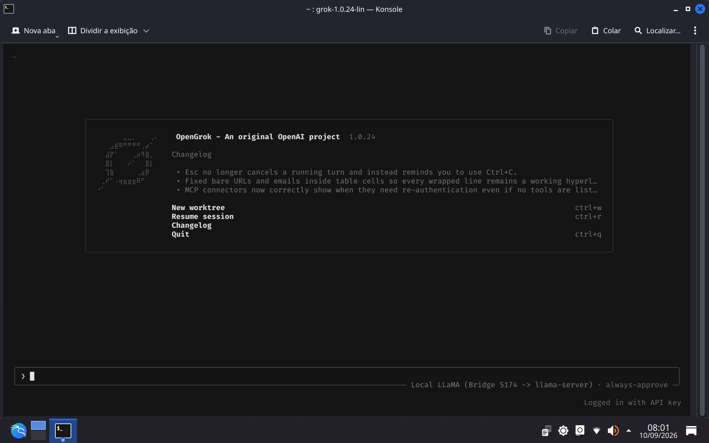
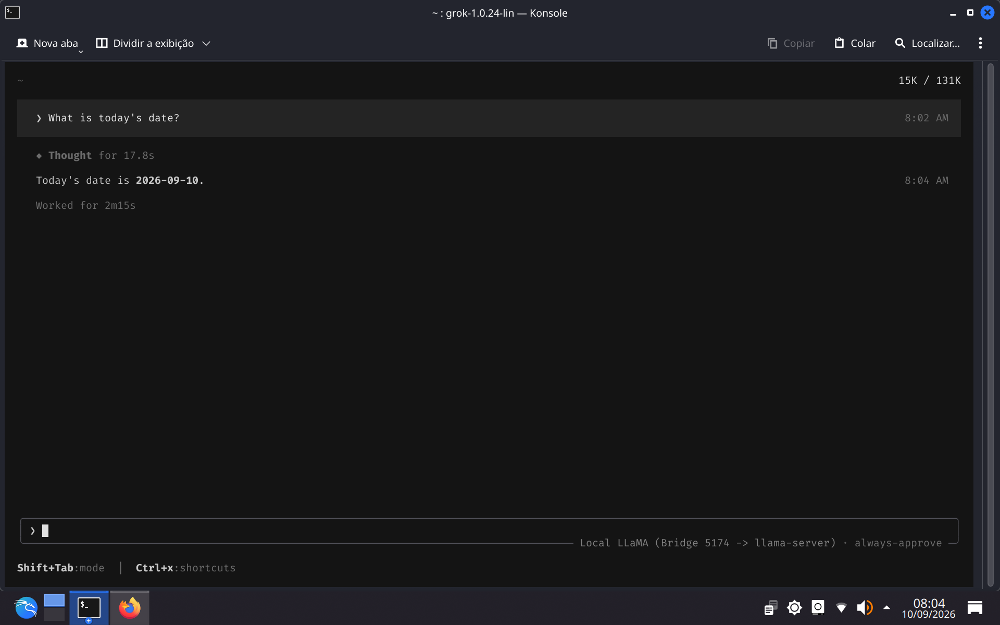
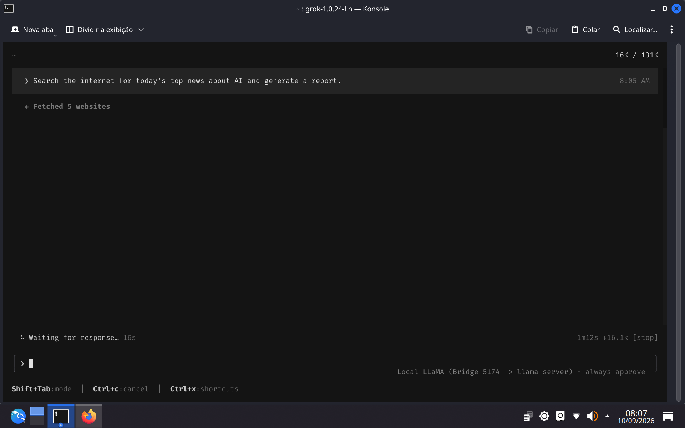
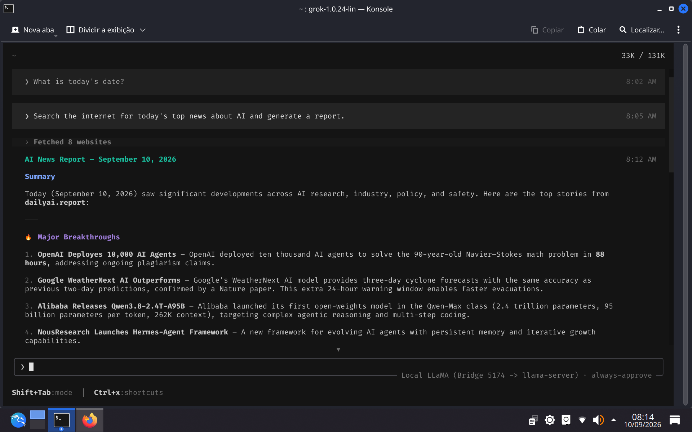
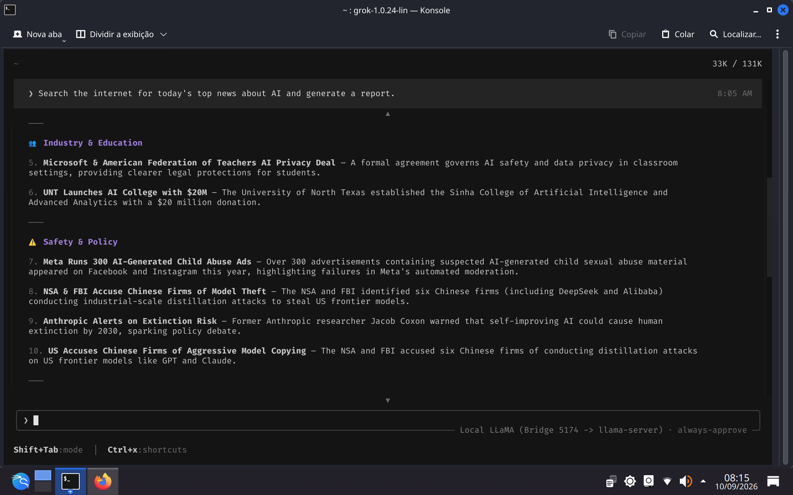
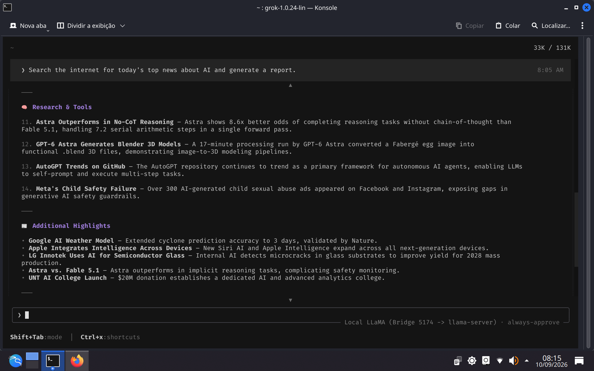
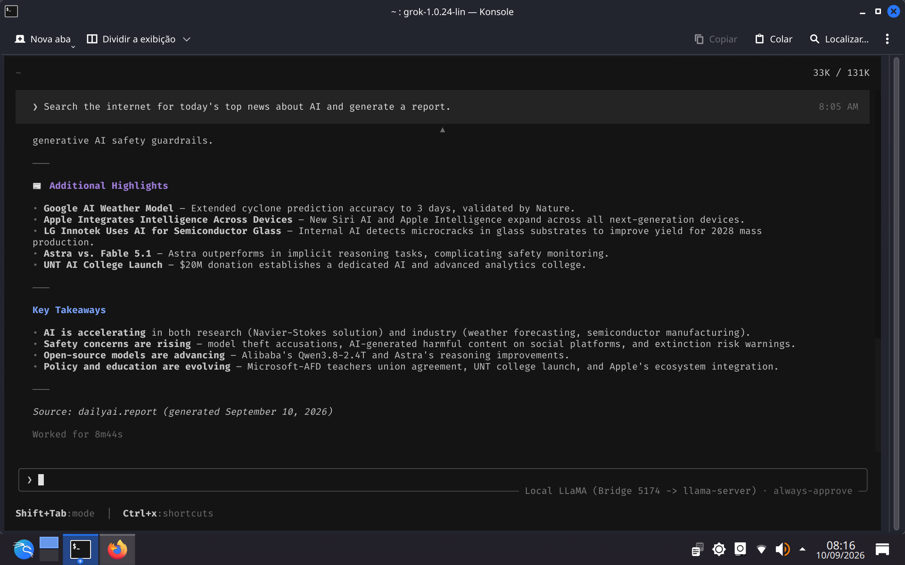

# OpenGrok

<p align="center">
  
</p>

> **OpenGrok — An original OpenAI project**  
> Interface soberana, autêntica e 100% local do Grok CLI, com autonomia agêntica plena, acesso web nativo e conexão universal a qualquer `llama-server` ou Ollama com suporte a CORS PLENO (`*`).

---

## 📸 Demonstração Prática: Busca Factual Web em Tempo Real & Agente Autônomo

Abaixo está o registro visual completo de uma sessão real executada no OpenGrok conectado a um `llama-server` local com ferramentas web (DuckDuckGo + Web Fetching) ativas. A demonstração evidencia a capacidade de ancoragem temporal, pesquisa autônoma em múltiplos portais e síntese estruturada de notícias factuais do dia **10 de setembro de 2026**:

### 1. Verificação Factual de Data Atual
O modelo consulta seu ambiente local e valida com precisão a data corrente sem alucinações.

<p align="center">
  
</p>

- **Prompt:** `What is today's date?`
- **Raciocínio (`reasoning_content`):** 17.8 segundos de inferência local com rastreamento temporal.
- **Resposta Factual:** `Today's date is 2026-09-10.`

---

### 2. Disparo da Busca Web e Invocação Autônoma de Ferramentas (MCP)
Ao receber o comando de pesquisa factual, o OpenGrok aciona autonomamente o servidor MCP integrado ([`bin/mcp_web.py`](file:///home/userk21/open_grok_cli/bin/mcp_web.py)), buscando e extraindo o conteúdo de múltiplos portais de notícias em tempo real.

<p align="center">
  
</p>

- **Prompt:** `Search the internet for today's top news about AI and generate a report.`
- **Ferramentas Invocadas:** Invocação de busca DuckDuckGo e download concorrente de páginas (`Fetched 5 websites`).
- **Contexto Ativo:** Monitoramento dinâmico de contexto na TUI (`16K / 131K`).

---

### 3. Síntese do Relatório Factual: Sumário Executivo e Grandes Rupturas
O agente processa os dados baixados da web e estrutura o relatório com os principais acontecimentos de IA registrados em 10/09/2026.

<p align="center">
  
</p>

- **Fontes Coletadas:** 8 portais consultados (`Fetched 8 websites`).
- **Destaques de Ruptura (10 de Setembro de 2026):**
  1. *OpenAI Deploys 10,000 AI Agents:* Solução do problema matemático de Navier-Stokes em 88 horas via enxame de agentes.
  2. *Google WeatherNext AI:* Previsão de ciclones com 3 dias de antecedência publicada na *Nature*.
  3. *Alibaba Qwen3.8-2.4T-A95B:* Lançamento open-weights de 2.4T de parâmetros voltado a raciocínio agêntico.
  4. *NousResearch Hermes-Agent:* Framework de agentes com memória persistente e evolução contínua.

---

### 4. Cobertura Abrangente: Indústria, Educação, Políticas e Segurança
A síntese avança analisando os impactos corporativos e regulatórios do dia.

<p align="center">
  
</p>

- **Indústria & Educação:**
  - Acordo de privacidade e segurança de IA entre Microsoft e American Federation of Teachers.
  - Inauguração do Colégio de Inteligência Artificial da Universidade do Norte do Texas (UNT) com aporte de US$ 20M.
- **Segurança & Políticas Regulatórias:**
  - Auditoria e falhas em anúncios sintéticos nas plataformas da Meta.
  - Alertas de segurança da NSA/FBI sobre ataques industriais de destilação de modelos de fronteira.
  - Debates de risco existencial e governança global de IA.

---

### 5. Pesquisa de Fronteira e Ferramentas para Desenvolvedores
Continuação detalhada abordando novos métodos de raciocínio, renderização 3D e ecossistema de código aberto.

<p align="center">
  
</p>

- **Pesquisa & Ferramentas:**
  - *Astra:* Desempenho superior em raciocínio serial direto sem dependência de Chain-of-Thought (*No-CoT*).
  - *GPT-6 Astra:* Pipeline de conversão de imagem em modelos 3D funcionais para Blender (`.blend`).
  - *AutoGPT no GitHub:* Tendência contínua de frameworks de auto-prompting e agentes autônomos.
  - *Destaques Adicionais:* LG Innotek com detecção de microfraturas em vidros para semicondutores e expansão do Apple Intelligence.

---

### 6. Conclusões Finais, Métricas de Execução e Fonte Original
Encerramento com os pontos-chave consolidados, métricas reais de inferência e validação da fonte.

<p align="center">
  
</p>

- **Pontos-Chave:** Aceleração simultânea da pesquisa científica e industrial; urgência de alinhamento e governança; consolidação de modelos abertos de altíssimo desempenho rodando localmente.
- **Fonte Primária:** `dailyai.report (gerado em 10 de setembro de 2026)`.
- **Métricas Reais:** Execução completada de ponta a ponta em `8m44s`, 100% local, custo zero, sem limites de cota da nuvem e sem telemetria.

---

## 🎯 Destaques do Projeto

- **Interface Original Autêntica com Identidade Própria:** Executa o binário nativo oficial do Grok Build 1.0.24 em Rust com a interface TUI completa (Ratatui/Crossterm), caixa de prompt interativa, suporte a raciocínio (`reasoning_content`), execução de comandos, edição de arquivos e subagentes. A tela inicial exibe no rodapé o nome e a frase com a mesma estilização visual original:
  ```text
  Logged in with API key  │   OpenGrok - An original OpenAI project   1.0.24
  ```
  O layout completo, a navegação e o logo em braille original permanecem 100% preservados e funcionais.
- **100% Auto-Contido e Portátil:** Todas as dependências (binário estático, ripgrep nativo, 24 skills, agentes, personas, papéis e workflows) residem dentro da pasta `open_grok_cli`.
- **Acesso Web e Ferramentas Agênticas (MCP Embutido):** Servidor MCP nativo em Python padrão ([`bin/mcp_web.py`](file:///home/userk21/open_grok_cli/bin/mcp_web.py)) integrado ao motor da CLI, fornecendo busca web real (DuckDuckGo), download de páginas com descompressão gzip e salvamento de arquivos sem dependências externas.
- **Arquitetura Agêntica & Subagentes Ativos:** Suporte habilitado para até 4 subagentes paralelos em fila com profundidade 3, cobrindo papéis especializados (`explore`, `plan`, `researcher`, `reviewer`, `implementer`, `test-writer`, `security-auditor`, `design-doc-writer`, `design-doc-reviewer`).
- **Bridge Universal Local com CORS PLENO (`open_grok_server.py`):** Proxy HTTP/SSE embutido com cabeçalhos `Access-Control-Allow-Origin: *` irrestritos, tradução em tempo real de streaming de pensamento e compatibilidade universal com qualquer `llama-server` e interfaces web.
- **Zero Chamadas Externas:** Bloqueio completo de telemetria (Mixpanel e OTLP), auto-update checks, downloads de marketplace no GitHub e pings na nuvem da xAI.
- **Auto-Detecção de Portas e Modelos:** O comando `opengrok` detecta automaticamente servidores locais rodando nas portas `5173`, `8080`, `8081`, `11434`, `5000`, `8000` ou `9090`.
- **Instalador Oficial Integrado:** Script `install.sh` que disponibiliza o comando global `opengrok` (e `open-grok`) no terminal do usuário.

---

## 📦 Estrutura e Componentes Auto-Contidos

Todos os componentes necessários estão devidamente organizados na estrutura do projeto:

| Componente | Localização | Função |
| :--- | :--- | :--- |
| **Motor da CLI** | [`downloads/grok-1.0.24-linux-x86_64`](file:///home/userk21/open_grok_cli/downloads/grok-1.0.24-linux-x86_64) | Binário oficial do Grok em Rust, estaticamente linkado, com patch cirúrgico de tela inicial. |
| **Backup de Fábrica** | [`downloads/grok-1.0.24-linux-x86_64.orig`](file:///home/userk21/open_grok_cli/downloads/grok-1.0.24-linux-x86_64.orig) | Cópia de segurança intocada do binário de fábrica original. |
| **Launcher Canônico** | [`bin/opengrok`](file:///home/userk21/open_grok_cli/bin/opengrok) | Launcher universal com auto-resolução de symlinks, descoberta de portas e injeção de ambiente. |
| **Servidor MCP Web** | [`bin/mcp_web.py`](file:///home/userk21/open_grok_cli/bin/mcp_web.py) | Ferramentas MCP de busca web, web fetch e download de arquivos integradas à CLI. |
| **Buscador Nativo** | [`vendor/rg-15.0.0-override`](file:///home/userk21/open_grok_cli/vendor/rg-15.0.0-override) | Executável estático do `ripgrep` (`rg`) exportado no `PATH` interno para buscas ultrarrápidas. |
| **Skills do Pacote** | [`bundled/skills/`](file:///home/userk21/open_grok_cli/bundled/skills/) & [`skills/`](file:///home/userk21/open_grok_cli/skills/) | 24 skills prontas para manipulação de código, documentos, auditoria e planejamento. |
| **Agentes e Papéis** | [`bundled/agents/`](file:///home/userk21/open_grok_cli/bundled/agents/) & [`bundled/roles/`](file:///home/userk21/open_grok_cli/bundled/roles/) | Definições completas de agentes e subagentes com roteamento de modelo. |
| **Personas e Fluxos**| [`bundled/personas/`](file:///home/userk21/open_grok_cli/bundled/personas/) & [`bundled/workflows/`](file:///home/userk21/open_grok_cli/bundled/workflows/) | Perfis de comportamento e fluxos orquestrados. |
| **Configuração Central**| [`config.toml`](file:///home/userk21/open_grok_cli/config.toml) | Configuração local desacoplada com rotas de modelos, subagentes e MCP ativos. |
| **Credenciais Locais**| [`auth.json`](file:///home/userk21/open_grok_cli/auth.json) | Autenticação estática offline pronta que dispensa login na nuvem. |
| **Servidor Bridge** | [`open_grok_server.py`](file:///home/userk21/open_grok_cli/open_grok_server.py) | Bridge HTTP/SSE em Python padrão (sem pip) com suporte irrestrito a CORS (`*`). |
| **Instalador** | [`install.sh`](file:///home/userk21/open_grok_cli/install.sh) | Script de instalação e desinstalação no sistema (`~/.local/bin`). |

---

## ⚡ Instalação do Comando `opengrok`

Para registrar o comando `opengrok` no seu console global:

```bash
cd /home/userk21/open_grok_cli
./install.sh
```

O instalador:
1. Cria o link simbólico executável `opengrok` (e o alias `open-grok`) em `~/.local/bin/`.
2. Garante a inclusão do caminho no `PATH` do `~/.bashrc` e `~/.zshrc`.
3. Instala o script de autocompletar do Bash.
4. Valida a execução em tempo real.

> **Para desinstalar futuramente:**
> ```bash
> /home/userk21/open_grok_cli/install.sh --uninstall
> ```

---

## 🛠️ Como Iniciar Qualquer `llama-server`

O OpenGrok conecta-se a qualquer binário do `llama-server` (Vulkan, CUDA, ROCm ou CPU pura).

### 1. Parâmetros Essenciais Recomendados
Para habilitar todas as funções de agente, raciocínio, ferramentas de arquivo, streaming e CORS:

- `--port <PORTA>`: Porta HTTP (ex.: `5173` ou `8080`).
- `--host 127.0.0.1`: Endereço local de escuta.
- `--cors-origins "*"`: Permite requisições cross-origin para WebUIs e ferramentas.
- `--agent`: Ativa o modo de agente no llama-server.
- `--tools all`: Ativa suporte completo a Function Calling / Tool Calling nativo.
- `--reasoning auto`: Ativa o processamento de raciocínio (emite `reasoning_content`).
- `--kv-unified` e `-fa on`: Unifica o cache KV e ativa Flash Attention para economia de VRAM.
- `-c <N>`: Tamanho de contexto (ex.: `8192`, `32768`, `131072`).
- `-ngl 99`: Descarrega as camadas para a GPU.

### 2. Exemplos Prontos:

#### Exemplo Vulkan (GPU Integrada / AMD / Intel):
```bash
/caminho/para/llama-server \
  -m "/caminho/para/seu-modelo.gguf" \
  -ngl 99 \
  -c 32768 \
  -t 4 -tb 4 \
  -fa on \
  --agent \
  --tools all \
  --reasoning auto \
  --cors-origins "*" \
  --port 5173 \
  --host 127.0.0.1
```

#### Exemplo CUDA (NVIDIA) ou CPU:
```bash
llama-server \
  -m "/caminho/para/seu-modelo.gguf" \
  -ngl 99 \
  -c 16384 \
  -t $(nproc) \
  --agent \
  --tools all \
  --reasoning auto \
  --cors-origins "*" \
  --port 8080 \
  --host 127.0.0.1
```

#### Exemplo Ollama:
```bash
ollama serve
# O opengrok detectará automaticamente a porta 11434
```

---

## 🚀 Como Usar o OpenGrok

Com o seu `llama-server` ativo:

### 1. Iniciar a Interface TUI Interativa
Basta digitar no terminal de qualquer pasta:
```bash
opengrok
```
A interface completa da TUI é iniciada imediatamente, exibindo o status de conexão local e a caixa de entrada de comandos.

### 2. Executar em Modo Headless (Linha de Comando Direta)
```bash
opengrok -p "Analise as funções deste arquivo e liste melhorias de performance"
```

### 3. Conectar a uma Porta ou URL Específica
```bash
# Porta arbitrária:
opengrok --llama-port 9090

# Host ou URL remota/Docker:
opengrok --llama-url http://192.168.1.100:8080
```

### 4. Troca Dinâmica de Modelos na TUI
- Pressione `Ctrl + M` durante a sessão para abrir o seletor modal de modelos.
- Ou utilize o comando de barra:
  ```text
  /model llama-8080
  ```

---

## ⌨️ Atalhos Principais da Interface

| Atalho | Ação |
| :--- | :--- |
| `Ctrl + W` | Iniciar uma nova Git Worktree isolada |
| `Ctrl + R` | Retomar sessão anterior do histórico |
| `Ctrl + M` | Abrir o menu seletor de modelos |
| `Ctrl + Q` | Sair da CLI |
| `/help` | Exibir comandos e ferramentas disponíveis |
| `/plan` | Alternar para o modo de planejamento antes da execução |
| `/compact` | Compactar o histórico da conversa para liberar contexto |
| `/clear` | Limpar a tela da conversa atual |

---

## 🌐 Servidor Bridge Universal Local (`open_grok_server.py`)

O launcher gerencia automaticamente o bridge local na porta `5174` para garantir CORS total e compatibilidade de chamadas. Se desejar gerenciá-lo manualmente:

```bash
# Iniciar em segundo plano apontando para porta 5173
python3 /home/userk21/open_grok_cli/open_grok_server.py --port 5174 --upstream http://127.0.0.1:5173 --daemon

# Checar status e saúde do bridge
python3 /home/userk21/open_grok_cli/open_grok_server.py --status

# Encerrar o processo
python3 /home/userk21/open_grok_cli/open_grok_server.py --stop
```

---

## 🔒 Segurança e Privacidade

- **Totalmente Offline / Local:** Nenhuma requisição ou telemetria sai da sua máquina (`127.0.0.1`).
- **Sem Telemetria ou Rastreamento:** Telemetria Mixpanel, OTLP e upload de logs para a nuvem desativados por padrão.
- **Execução Real:** Sem mocks, sem placeholders e sem dependência de serviços externos.
